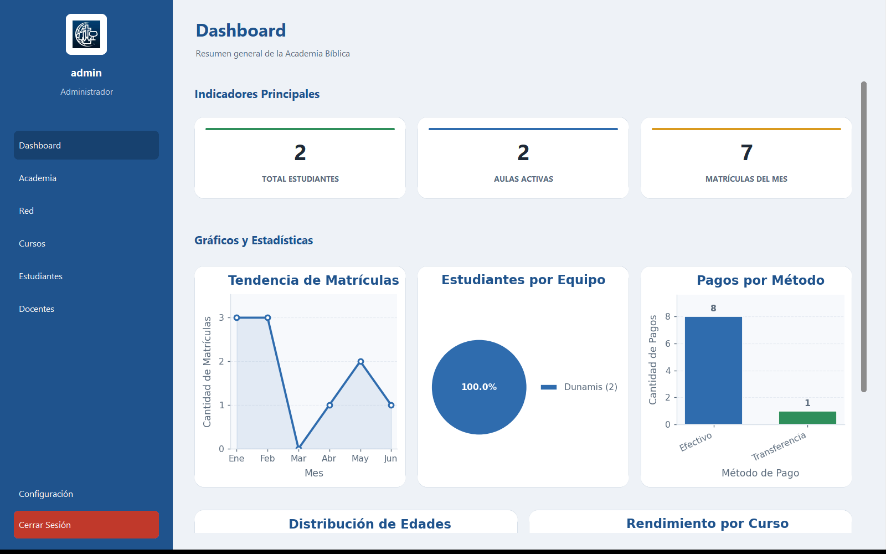
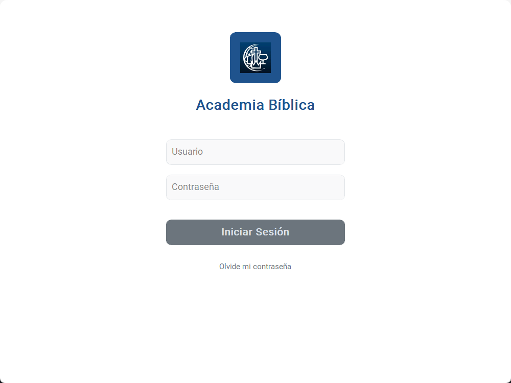
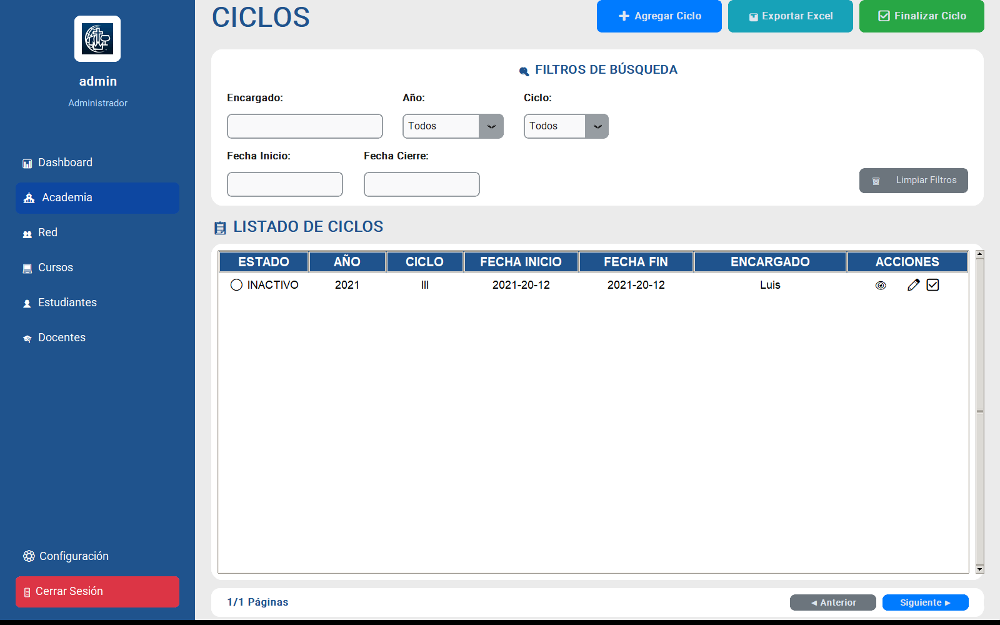
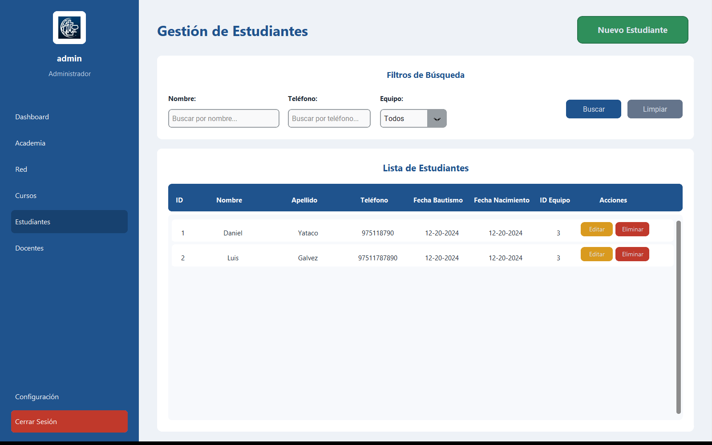
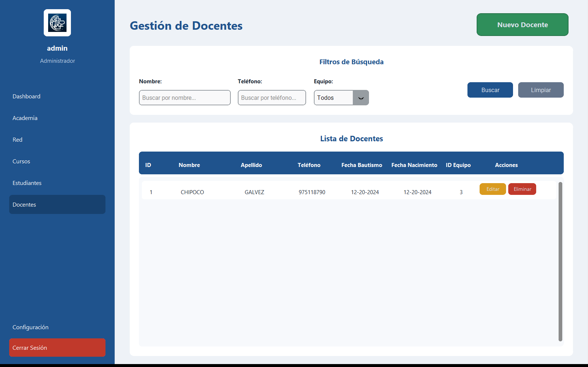
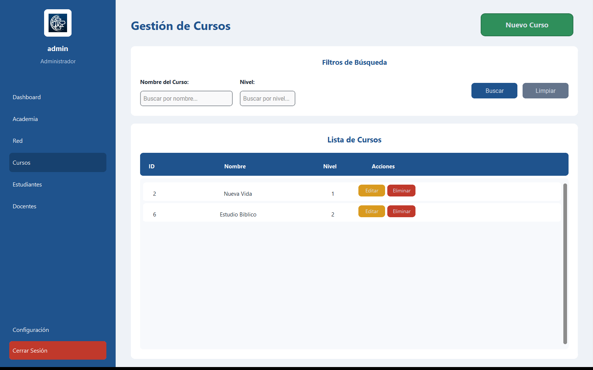
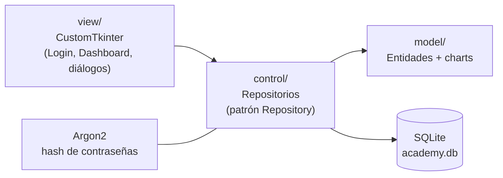
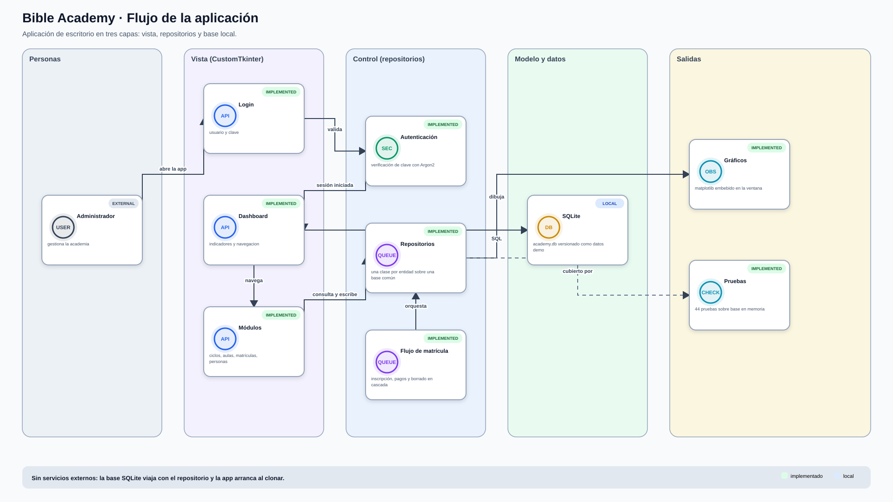
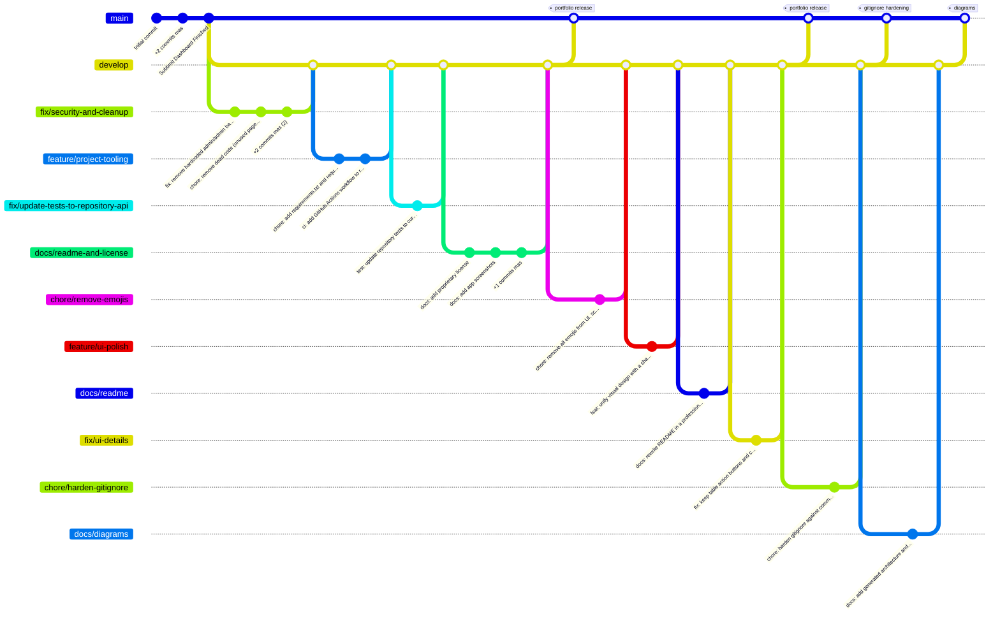

# Bible Academy — Sistema de Gestión Académica de Escritorio

<p align="center">
  
</p>

<p align="center">
  
  
  
  
  
</p>

Aplicación de escritorio para la **gestión integral de una academia bíblica**: ciclos académicos, aulas, matrículas con control de pagos, estudiantes, docentes, equipos y cursos. Incluye autenticación real con Argon2, un dashboard de indicadores con gráficos embebidos y una suite de tests automatizados.

## Funcionalidades

- **Autenticación segura** contra SQLite con hash **Argon2** y gestión de usuarios con roles.
- **Dashboard de indicadores**: KPIs (estudiantes, aulas activas, matrículas del mes) y cinco gráficos matplotlib embebidos (tendencia de matrículas, distribución por equipo, pagos por método, distribución de edades y rendimiento por curso).
- **Gestión académica completa**: ciclos → aulas → matrículas → pagos, con flujo de inscripción guiado y borrado en cascada.
- **CRUD** de estudiantes, docentes, equipos y cursos con búsqueda, filtros, paginación y menús contextuales.
- **Patrón Repository** sobre SQLite con base de datos demo incluida: la aplicación funciona al clonar el repositorio, sin configuración adicional.
- **Interfaz unificada** mediante un módulo de diseño (`view/theme.py`) que centraliza la paleta de colores, la tipografía, el espaciado y el estilo de las tablas.
- **44 tests** de repositorios con pytest sobre SQLite en memoria, ejecutados en CI con GitHub Actions.

## Interfaces

| Login | Gestión de ciclos |
|---|---|
|  |  |

| Estudiantes | Docentes |
|---|---|
|  |  |

| Cursos |
|---|
|  |

## Arquitectura



- **`view/`** — páginas y diálogos CustomTkinter, sistema de diseño compartido (`theme.py`) y gráficos matplotlib embebidos mediante `backend_tkagg`.
- **`control/`** — un repositorio por entidad heredando de `base_repository.py` (API basada en diccionarios), inicialización de la base de datos y flujo de inscripción.
- **`model/`** — entidades (`BaseEntity`) y generadores de gráficos.
- **`tests/`** — nueve suites de tests de repositorio contra SQLite en memoria.

## Instalación y ejecución

```bash
git clone https://github.com/danielyatacoblas/bible-academy.git
cd bible-academy
pip install -r requirements.txt
python app.py
```

**Credenciales demo:** usuario `admin`, contraseña `admin`. La base de datos demo incluida ya trae datos de ejemplo; si no existe, se crea automáticamente al iniciar la aplicación.

### Ejecutar los tests

```bash
pip install -r requirements-dev.txt
python -m pytest tests/ -v    # 44 passed
```

## Stack

| Capa | Tecnología |
|---|---|
| UI | CustomTkinter + tkinter/ttk |
| Gráficos | matplotlib + numpy |
| Base de datos | SQLite (módulo estándar `sqlite3`) |
| Seguridad | argon2-cffi (hash de contraseñas) |
| Tests / CI | pytest + GitHub Actions |

## Diagramas

Ambos diagramas se generan con `scripts/render_diagrams.py` a partir de
`diagrams/architecture.json`, que es la fuente de verdad. Al cambiar la
arquitectura o el modelo de ramas se edita ese archivo y se vuelven a generar,
de modo que la documentacion no se desincroniza del proyecto.

### Flujo de la aplicacion



### Flujo de trabajo con Git

El repositorio sigue Git Flow: `main` siempre desplegable, `develop` como
integracion, y una rama por cambio. Los merges son `--no-ff` para que cada
funcionalidad quede como un bloque legible en el historial, y cada version
llega a `main` etiquetada.

Este es el historial real del repositorio, no un ejemplo:



Regenerar despues de editar la especificacion:

```bash
python scripts/render_diagrams.py --render-png   # SVG, PNG y mermaid
python scripts/render_diagrams.py --check        # falla si quedaron desactualizados
```

## Autor

**Daniel Yataco Blas** — [GitHub](https://github.com/danielyatacoblas)

## Licencia

Proyecto de portafolio bajo **licencia propietaria**: el código puede consultarse con fines de evaluación profesional, pero no copiarse, redistribuirse ni reutilizarse sin autorización escrita. Ver [LICENSE](LICENSE).
